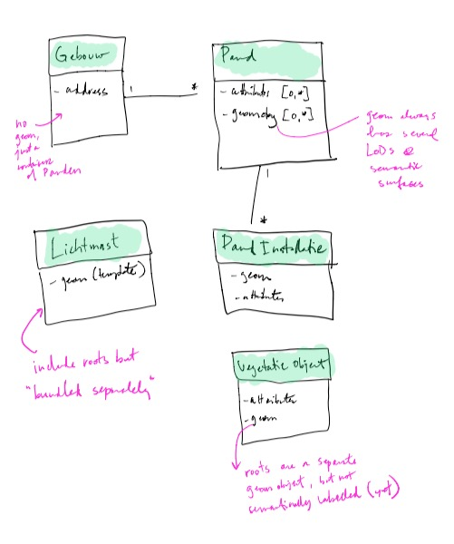

# Draft data model for NL3D project

Example dataset all merged is `/data/rotterdam/cityjson/all.json`

The schema is `/schemas/extensions/nl_3d.json`

It's pretty simple at this moment, looks like this:

